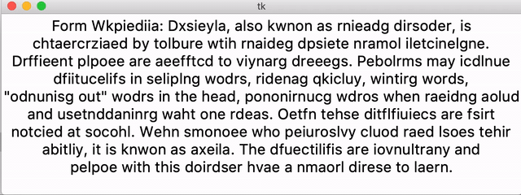

# jumpying words

Let words in a text jump around to show how hard reading is when
suffering from [dyslexia](https://en.wikipedia.org/wiki/Dyslexia).


## Install

Make sure you have installed `Tkinter` and run

```bash
pip install -r requirements.txt
```

to install all python libraries needed.


## Usage

Run

```bash
python start.py /path/to/text
```


## Example

After executing

```bash
python start.py example_text
```

a window opens showing you something like that:

